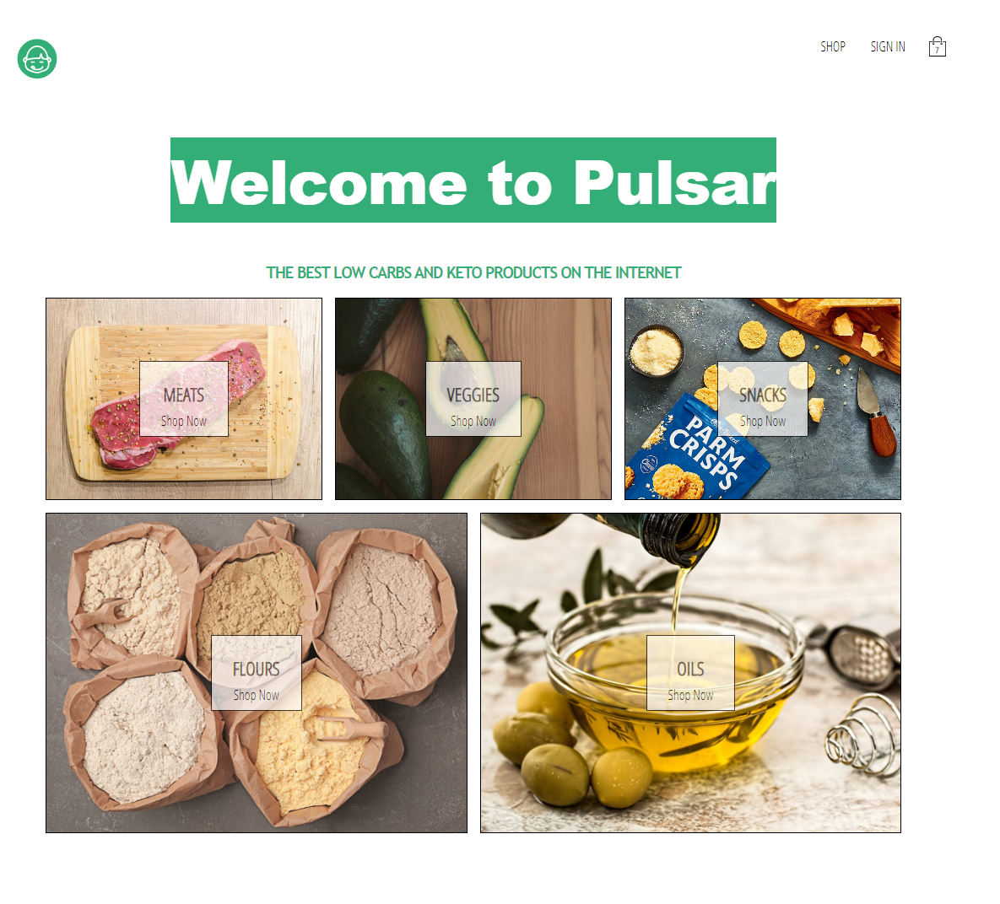
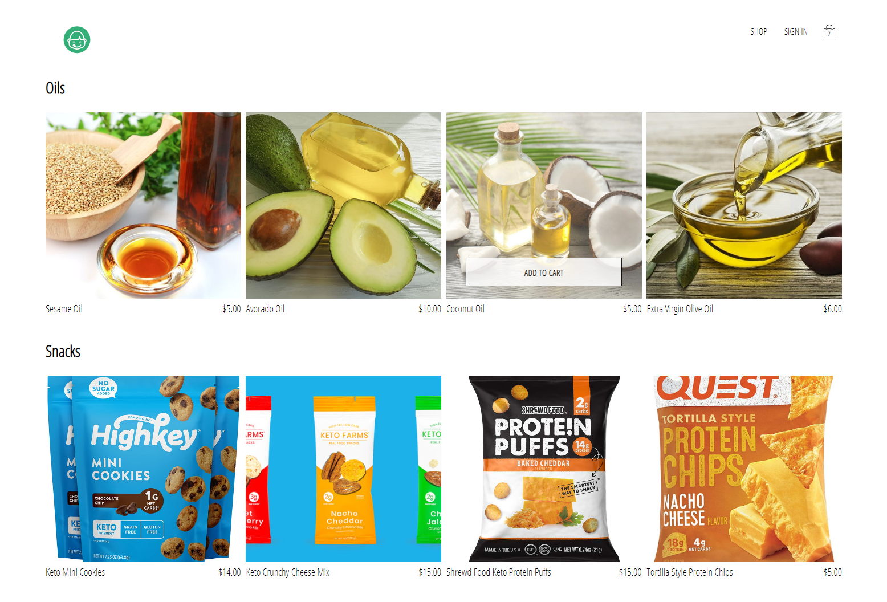

# EV-Wheels Store

> An online grocery store allowing users to order low carbs and keto products.

## Table of contents

- [General info](#general-info)
- [Project Demo](#project-demo)
- [Project Video](#project-video)
- [Technologies](#technologies)
- [Setup](#setup)
- [Features](#features)
- [Inspiration](#inspiration)
- [Contact](#contact)
- [License](#license)

## General info

Pulsar store is an easy-to-use e-commerce store that allows shoppers to buy keto-friendly products. It contains all the e-commerce essentials for adding products and using Stripe and personal credit cards as payment systems.

<div align="center">Pulsar </div>
<br/>
<div align="center">
<kbd>

</kbd>
</div>

<br/>
<div align="center">
<kbd>

</kbd>
</div>

## Project Demo

[Click to view site](https://pulsar-live.herokuapp.com/)

- Login

```
user: tom@gmail.com
pass: 123456
```

## Project Video

[Click to view demo of Pulsar store](./client/src/assets/pulsar.gif)

## Technologies

### Backend Development

- "Node.js"
- "body-parser" - version "1.18.3"
- "compression" - version "1.7.4"
- "cors" - version "2.8.5"
- "dotenv" - version "7.0.0"
- "express" - version "4.16.4"
- "stripe" - version "6.28.0"

### Frontend Development

- "axios" - version "0.19.2"
- "firebase" - version "7.7.0"
- "node-sass" - version "4.13.0"
- "react" - version "16.12.0"
- "react-dom" - version "16.12.0"
- "react-redux" - version "7.1.3"
- "react-router-dom" - version "5.1.2"
- "react-scripts" - version "3.0.0"
- "react-stripe-checkout" - version "2.6.3"
- "redux" - version "4.0.5"
- "redux-logger" - version "3.0.6"
- "redux-thunk" - version "2.3.0"

## Setup: To try out this project:

##### Client

1. Clone the GitHub repository locally to your computer
1. In the command line, navigate to the root directory of the repository, and type the following:
   $ npm install
1. Navigate to the client folder, and in the root directory of the client folder, type the following:
   $ npm install
1. In the client folder, and in the root directory of the client folder, type the following:
   $ npm start

##### Server

1. Navigate to the server folder, and in the root directory of the server folder, type the following:
   $ npm install
1. Create an `.env` files for server.
1. Create a Stripe account and get the key

```
STRIPE_SECRET_KEY=your-key-here
```

4. `npm dev` to start the client and server together
5. Visit `localhost:5000`

## Code Examples

### Node.js/Express.js

```Node
if (process.env.NODE_ENV === "production") {
  app.use(express.static(path.join(__dirname, "client/build")));

  app.get("*", function(req, res) {
    res.sendFile(path.join(__dirname, "client/build", "index.html"));
  });
}

app.listen(PORT, error => {
  if (error) throw error;
  console.log("Server is running on port " + PORT);
});
```

### JavaScript/React.js

```jsx
const CartDropDown = ({ cartItems, history, dispatch }) => (
  <div className='cart-dropdown'>
    <div className='cart-items'>
      {cartItems.length ? (
        cartItems.map((cartItem) => (
          <CartItem key={cartItem.id} item={cartItem} />
        ))
      ) : (
        <span className='empty-message'>Your cart is empty</span>
      )}
    </div>

    <CustomButton
      onClick={() => {
        history.push('/checkout');
        dispatch(toggleCartHidden());
      }}
    >
      Go To Checkout
    </CustomButton>
  </div>
);

const mapStateToProps = createStructuredSelector({
  cartItems: selectCartItems,
});

export default withRouter(connect(mapStateToProps)(CartDropDown));
```

## Features

- Full stack web application utilizing the FERN stack: Firebase, Express.js, React, and Node.js.
- Authorization and authentication implemented with Firebase and Google accounts.
- Front-End styles and shop components built with CSS and Sass.
- Users can create account through application.
- Users can add shop, add items and checkout with Stripe payment and credit cards.
- Add keto products and update them as they get processed

## Status

Project is: finished with option to expand functionality and DRY out code.

## Inspiration

The inspiration for the Pulsar store came as I was on my keto diet and shopping for keto products at the grocery store. Keto shopping took me a while because not many stores are keto-friendly, so I decided to create a store to sell only keto products.

## Contact

Created by [Van Vy](vanby.com)
Feel free to contact me for any questions!

## License

[](https://www.gnu.org/licenses/gpl-3.0)
